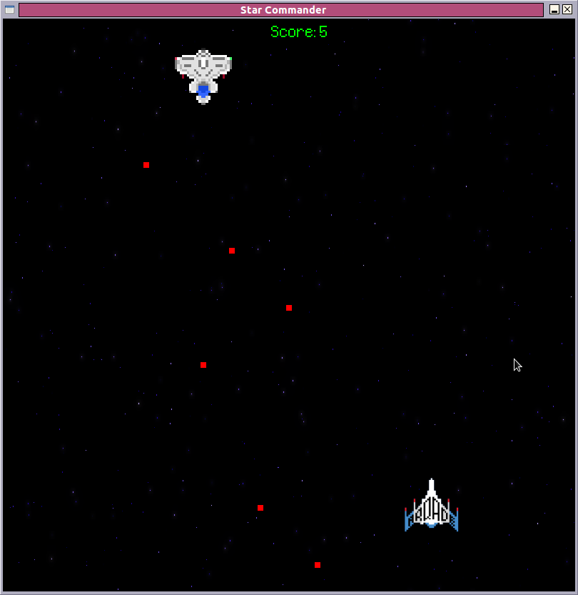

# Star Commander #

A game.



## Requirements ##

* sdl2
* opengl (3+)
* glew
* libSOIL
* glm

### optional requirements ###

* astyle (2.04+)
* cppcheck
* valgrind
* doxygen

## Project Structure ##
```
engine
|--> build (compiled objects and binaries)
|--> doc (documentation)
|--> lib (external dependencies)
|--> src (main code tree)
|--> test (unit tests)
```

## Notes ##
List all files installed by a package:
dpkg -L librname

Get into about installed packages
apt-cache search pkgname
